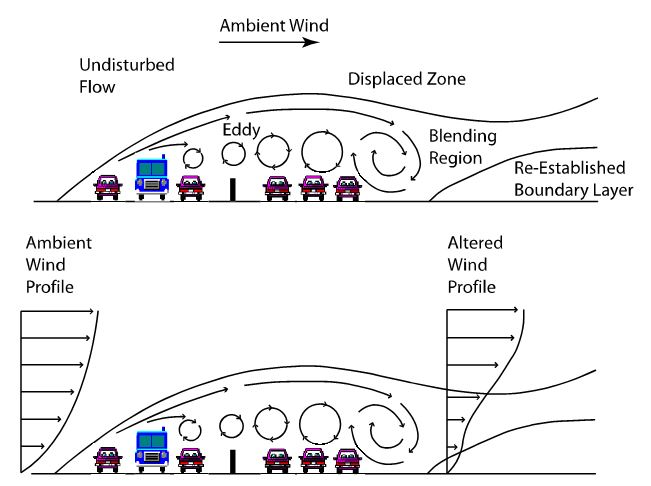
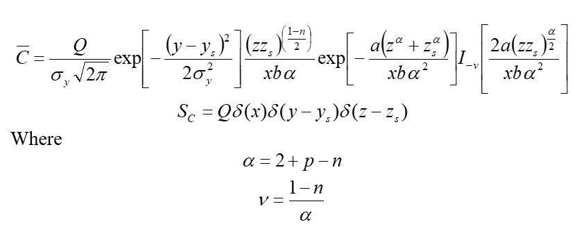
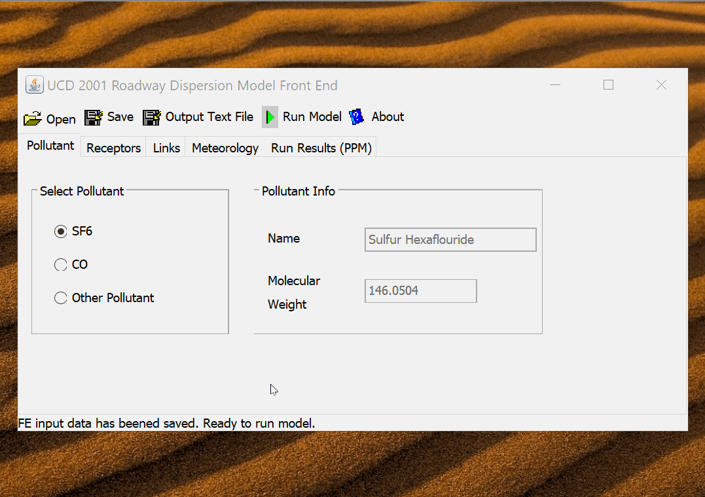

## Project Name & Summary
*The UCD_2001 Air Quality Modeling Application.*

A novel model to simulate air quality near roadways using java.

## Table of contents
* [Project Description](#project-description)
* [Usage](#usage)
* [Screenshots](#screenshots)
* [License](#license)
* [Contact](#contact)
* [Resources & Acknowledgements](#Resources-&-Acknowledgements)

## Project Description

As part of my doctoral research to better predict air quality near roadways, 
I created a new computational model to account for the effects of vehicles 
on atmospheric turbulent fluid flow. 
I implemented my new framework in java, which at the time 
was a comparatively new programming language and was still in version J2SE 1.3.



My model characterized vehicle emissions on roadways 
as an immense collection of point sources. 
Pollutant concentration fields could be determined by summing the contribution 
of each point source to receptor locations using the following equations:



The goal of the research was to distill complex physical processes into 
a simple computer model that could be used by a non-experts 
to accurately determine air quality near roadways. 
A GUI was developed to allow users with little understanding 
of atmospheric physics to utilize the modeling framework
 via a simple java swing frontend.

The documentation of this software's API is extensive and can be viewed 
[here](https://tonyserver.github.io/ucd2001/docs/).  
In addition, select code blocks are presented in this repository.

Interested readers can review publications associated with this model 
[here](https://tonyserver.github.io/ucd2001/tony_held_air_quality_model_publication.pdf). 
Masochists who would like to read a dissertation on 
computational fluid mechanics can read my thesis 
[here](https://tonyserver.github.io/ucd2001/tony_held_dissertation_2001_10_05.pdf).

## Usage

To launch the gui frontend to the air quality model download the [ucd_2001_gui.jar](ucd_2001_gui.jar)
jar file and run it by double clicking or by the command:  
```
    java -jar ucd_2001_gui.jar
```

For a deeper dive into the API underpinning the model, 
take a quick peek and the app's object model and documentation
[here](https://tonyserver.github.io/ucd2001/docs/).  


## Screenshots


## License

Distributed under the *** License.  
See `*** License Info ***` for more information.

## Contact

Tony Held - tony.held@gmail.com  
Project Link: [https://github.com/TonySoloProjects/ucd_2001](https://github.com/TonySoloProjects/ucd_2001)

## Resources & Acknowledgements

* Special thanks to my advisor Daniel Chang for his boundless energy and dedication. 